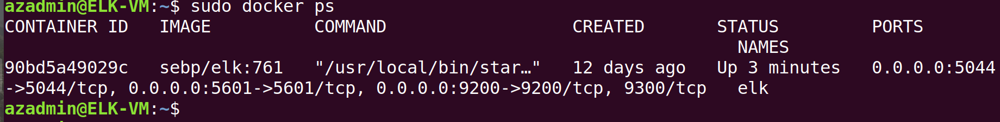

# Cyber_Project1
Cybersecurity Course Project 1
## Automated ELK Stack Deployment

The files in this repository were used to configure the network depicted below.

https://drive.google.com/file/d/1uWvzUPnojZxWkQw2A5SPn00iTqJ15C2A/view?usp=sharing

These files have been tested and used to generate a live ELK deployment on Azure. These can be used to recreate the entire deployment pictured above. 

 - elk.yml 
 - filebeat-playbook.yml
 - metricbeat-playbook.yml

This document contains the following details:
- Description of the Topology
- Access Policies
- ELK Configuration
  - Beats in Use
  - Machines Being Monitored
- How to Use the Ansible Build

### Description of the Topology

The main purpose of this network is to expose a load-balanced and monitored instance of DVWA, the Damn Vulnerable Web Application.

Load balancing ensures that the application will be highly available, in addition to restricting overloads to the network.
- What aspect of security do load balancers protect? What is the advantage of a jump box?
    Load balancers ensures the availability in the CIA security triad
    Jump box provides single point of management access to the network assets, making it easy to secure the the assets from illegal access.

Integrating an ELK server allows users to easily monitor the vulnerable VMs for changes to the configuration and system metrics.
- Filebeat watch for any changes in the system configurations
- Metricbeat records the system metrics and send to Elkstack for visualization

The configuration details of each machine may be found below.
_Note: Use the [Markdown Table Generator](http://www.tablesgenerator.com/markdown_tables) to add/remove values from the table_.

| Name    | Function | IP       | Operating System |
|---------|----------|----------|------------------|
| JumpBox | Gateway  | 10.0.0.4 | Linux            |
| WebVm1  | DVMA     | 10.0.0.5 | Linux            |
| WebVm2  | DVMA     | 10.0.0.6 | Linux            |
| ElkVm   | Elcstack | 10.1.0.4 | Linux            |

### Access Policies

The machines on the internal network are not exposed to the public Internet. 

Only the JumpBox machine can accept connections from the Internet. Access to this machine is only allowed from the following IP addresses:
- 112.213.214.88

Machines within the network can only be accessed by JumpBox.
- ElkVm can only accept management connections from JumpBox with IP, 10.0.0.4

A summary of the access policies in place can be found in the table below.

| Name    | Publicly Accessible | Allowed IP Address |
|---------|---------------------|--------------------|
| JumpBox | Yes                 | 112.213.87.154     |
| WebVms  | No                  | 10.0.0.0/8         |
| ElkVm   | No                  | 10.0.0.4           |

### Elk Configuration

Ansible was used to automate configuration of the ELK machine. No configuration was performed manually, which is advantageous because,
- The code can be re-deployed as needed with no or very little changes.
- The entire network topology is therefore easy to backup and portable.
- The entire architecture can be re-deployed in few minutes.
- Since it is automated deployment the infrastructure configuration is always consistent and same

The playbook implements the following tasks:
- Install docker.io using apt module of Ansible
- Install python3.pip module using apt module
- Install docker module using PIP 
- Increase the virtual memory for the parameter vm_max_map_count to 262144
- Deploy and Launch a docker elk container using docker module
- Enable the docker service on boot using the systemd module

The following screenshot displays the result of running `docker ps` after successfully configuring the ELK instance.

### Target Machines & Beats
This ELK server is configured to monitor the following machines:
- _TODO: List the IP addresses of the machines you are monitoring_

We have installed the following Beats on these machines:
- _TODO: Specify which Beats you successfully installed_

These Beats allow us to collect the following information from each machine:
- _TODO: In 1-2 sentences, explain what kind of data each beat collects, and provide 1 example of what you expect to see. E.g., `Winlogbeat` collects Windows logs, which we use to track user logon events, etc._

### Using the Playbook
In order to use the playbook, you will need to have an Ansible control node already configured. Assuming you have such a control node provisioned: 

SSH into the control node and follow the steps below:
- Copy the _____ file to _____.
- Update the _____ file to include...
- Run the playbook, and navigate to ____ to check that the installation worked as expected.

_TODO: Answer the following questions to fill in the blanks:_
- _Which file is the playbook? Where do you copy it?_
- _Which file do you update to make Ansible run the playbook on a specific machine? How do I specify which machine to install the ELK server on versus which to install Filebeat on?_
- _Which URL do you navigate to in order to check that the ELK server is running?

_As a **Bonus**, provide the specific commands the user will need to run to download the playbook, update the files, etc._
